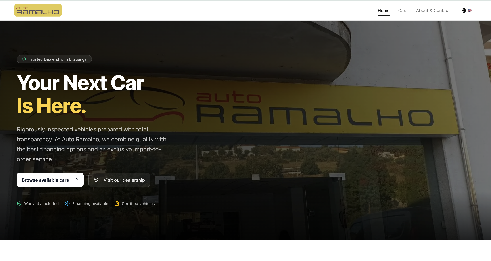
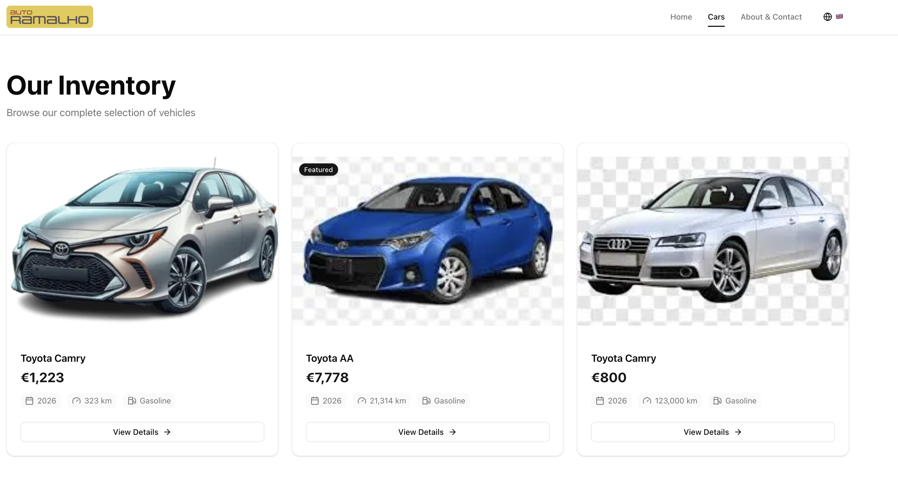
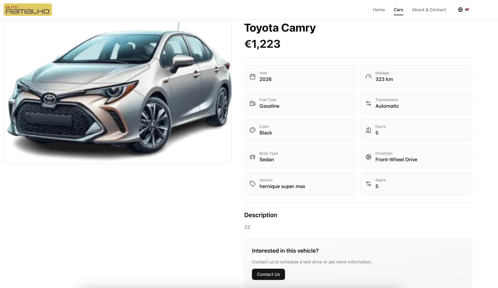
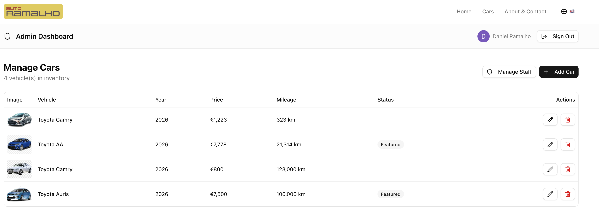

# Car Dealership

A **Next.js** car dealership showcase and admin app with multi-locale support, authentication, and inventory management.

## Features

- **Public site**: Home, car listing, car detail, and about pages
- **Admin**: Protected area for managing cars and users (NextAuth + Google OAuth)
- **i18n**: Locales `pt` (default), `en`, `es`, `fr` — dictionaries in `src/i18n/dictionaries/`
- **Stack**: Next.js 16, React 19, Prisma (Neon PostgreSQL), NextAuth, Cloudinary, Tailwind CSS, Radix UI / shadcn, Zod

## Screenshots

| Home | Cars | Car detail | Admin |
|------|------|------------|--------|
|  |  |  |  |

Add your screenshots to `docs/screenshots/` and name them `home.png`, `cars.png`, `car-detail.png`, and `admin.png` (or update the paths above).

## Prerequisites

- Node.js 18+
- A [Neon](https://neon.tech) (or compatible) PostgreSQL database
- [Google OAuth](https://console.cloud.google.com/apis/credentials) credentials
- [Cloudinary](https://cloudinary.com/console) account (for car images)

## Environment

Copy `.env.example` to `.env` and set:

| Variable | Description |
|----------|-------------|
| `DATABASE_URL` | PostgreSQL connection string (e.g. Neon) |
| `AUTH_SECRET` | NextAuth secret (`openssl rand -base64 32`) |
| `GOOGLE_CLIENT_ID` / `GOOGLE_CLIENT_SECRET` | Google OAuth credentials |
| `SEED_ADMIN_EMAIL` | Email that gets admin access when seeding |
| `NEXT_PUBLIC_CLOUDINARY_CLOUD_NAME` | Cloudinary cloud name |
| `CLOUDINARY_API_KEY` / `CLOUDINARY_API_SECRET` | Cloudinary API credentials |

## Getting Started

```bash
# Install dependencies
npm install

# Set up environment (see above)
cp .env.example .env

# Generate Prisma client and run migrations
npx prisma generate
npx prisma db push   # or prisma migrate dev

# Run development server
npm run dev
```

Open [http://localhost:3000](http://localhost:3000). Use a locale in the path (e.g. `/en`, `/pt`) or the default locale will be used.

## Scripts

| Command | Description |
|---------|-------------|
| `npm run dev` | Start dev server |
| `npm run build` | Prisma generate + Next.js build |
| `npm run start` | Start production server |
| `npm run lint` | Run ESLint |
| `npm run format` | Format with Prettier |
| `npm run format:check` | Check formatting |

## Customization

To use this project for your own dealership:

- **Brand & contact**: Edit `src/config/site.ts` (brand name, address, email, phone, Google Maps URLs).
- **Logo**: Replace `public/logo.svg` or point the Logo component to your asset.
- **Copy**: Update i18n dictionaries in `src/i18n/dictionaries/` (en, pt, es, fr) for metadata, hero, about, and footer.
- **Placeholder image**: Set `placeholderImage` in `src/config/site.ts` or replace `public/placeholder-image.svg`.

## Deploy

You can deploy on [Vercel](https://vercel.com) or any Node.js host. Set the same environment variables in your deployment environment and run `npm run build` then `npm run start`. See [Next.js deployment docs](https://nextjs.org/docs/app/building-your-application/deploying) for details.
